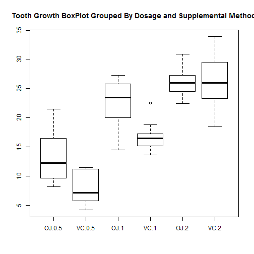
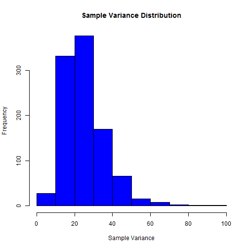
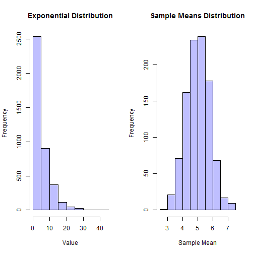

###Overview

This investigation will compare simulations from the exponential distribution to the expected mean and variance for a give value of lambda. A thousand sets of exponential distributions with forty samples each are generated, and for each set the mean and variance is calculated. The distribution of these values will then be compared to their theoretical counterparts, and the distribution of the means will be analyzed for approximate normality in line with the Central Limit Theorem.


###Analysis

#### 1.) Show the Sample mean and Compare it to the Theoretical Mean of the Distribution


```r
##

##Constants
samples = 40
sets = 1000
lambda = 0.2

##Get samples of means & variances
mean_exp_sample = NULL
var_exp_sample = NULL

## Get Initial data sets
for (i in 1: sets)
{
  cur_set = rexp(samples,lambda)
  mean_exp_sample = c(mean_exp_sample, mean(cur_set))
  var_exp_sample = c(var_exp_sample, var(cur_set))
}

## Generate the histogram data for the mean and variance data
h_mean_exp_sample = hist(mean_exp_sample, plot = FALSE)
h_var_exp_sample = hist(var_exp_sample, plot = FALSE)

## Calculate the theoretical mean for comparison
mean_theory = 1 / lambda
mean_theory
```

```
## [1] 5
```

```r
## Calculate the quantiles for the mean data set
summary(mean_exp_sample)
```

```
##    Min. 1st Qu.  Median    Mean 3rd Qu.    Max. 
##   2.953   4.487   5.016   5.018   5.549   7.354
```

From the median of the means distribution, it can be seen that the distribution is centered close to the theoretical mean. The theoretical mean for the exponential distribution is one divided by the value of lambda. The plot below shows the distribution centering around 5.


```r
## show a plot of the mean distribution
par(mfrow = c(1, 1))
plot(h_mean_exp_sample, col=rgb(0,0,1), main = "Sample Mean Distribution", xlab = "Sample Mean")
```

 

#### 2.) Show how variable the sample is (via variance) and compare it to the theoretical variance of the distribution.

The next item to look at is variability in the data sets generated with the exponential distribution.The theoretical variance for the exponential distribution is one divided by lambda to the second power.


```r
##Calculate the theoretical variance of the exponential distribution
rexp_theory_var = 1 / (lambda ^ 2)
rexp_theory_var
```

```
## [1] 25
```

```r
## Calculate the quantiles for the variance data set
summary(var_exp_sample)
```

```
##    Min. 1st Qu.  Median    Mean 3rd Qu.    Max. 
##   4.863  17.760  23.220  25.310  30.530  99.930
```

The theoretical mean comes out to 25, and by looking at the mean and median values of the variance data sets, it can be seen that the distribution for the sample variance data set is centered around 25. The distribution plot below shows the distribution being centered close to 25.


```r
## show a plot of the variance distribution
plot(h_var_exp_sample, col=rgb(0,0,1),main = "Sample Variance Distribution", xlab = "Sample Variance")
```

 

Lastly, the normality of the distribution of the means will be considered. The Central Limit Theorem would contend that a distribution like the exponential distribution would have a normal distribution of sampled means when the number of data sets is sufficiently large.

A comparison of the distribution a large number of samples from the exponential distribution function can be compared to the distribution of means from a large number of calculated means. From the comparison, it can be seen that the exponential function distribution looks exponential as expected, and the distribution of means looks normal by visual inspection

#### 3.) Show that the distribution is approximately normal.


```r
## Large distribution of random exponentials

large_set = rexp(samples * 100, lambda)
h_large_set = hist(large_set, plot = FALSE)

## Comparison of distribution of large set of random exponentials and distribution of large set of averages of 40 exponentials

par(mfrow = c(1, 2))
plot(h_large_set, col=rgb(0,0,1,1/4), main = "Exponential Distribution", xlab = "Value")
plot(h_mean_exp_sample, col=rgb(0,0,1,1/4), main = "Sample Means Distribution", xlab = "Sample Mean")
```

 

To take a closer look, the mean plus one standard deviation and mean minus one standard deviation values will be calculated and compared to the theorical quantile values of a normal distribution.


```r
## Calculate the quantiles for where +/- 1 standard deviation should be, and compare to the actual standard deviation
## (Mean +1 stdev = 84.1%, Mean -1 stdev = 15.9%)

quant_1_stdev =  quantile(mean_exp_sample, c(.159, .841))
mean_exp_sd = sd(mean_exp_sample)
mean_exp_mean = mean(mean_exp_sample)
stdev_check = c(mean_exp_mean - mean_exp_sd, mean_exp_mean + mean_exp_sd)
stdev_check = t(data.frame(stdev_check))

colnames(stdev_check) = c('Mean -1 STDEV','Mean +1 STDEV')

quant_1_stdev
```

```
##    15.9%    84.1% 
## 4.246597 5.786059
```

```r
stdev_check
```

```
##             Mean -1 STDEV Mean +1 STDEV
## stdev_check      4.253871      5.781999
```

The values match up well which suggests that distribution of means is close to normal. This is in line with expectations from the Central Limit Theorem.
